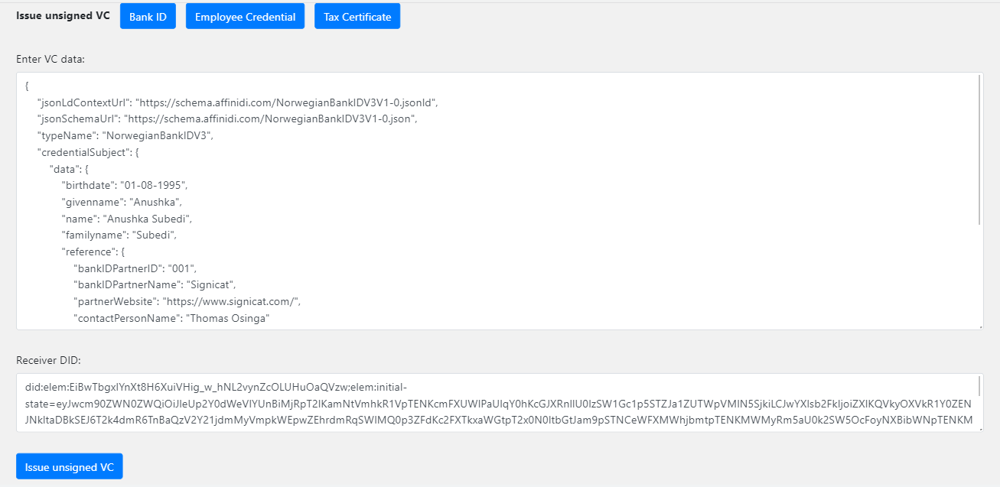

# Issuer web portal demo powered by Affinidi API

This is a react application that offers a UI and uses Affinidy's API to issue verifiable credentials. The portal can be used to fill in user data by BankID Issuers, Employer and Norwegian Tax Authority which are the three issuers in our implementation. Ideally, they would have their own respective portal but since, it is a proof-of-concept implementation, all three credentials can be issued through the same web portal. The credentials contain their respective attributes which is signed and presented to the user. Once issued, it can be stored by the holder in their wallet.

## Pre-requisite
- [npm](https://www.npmjs.com/get-npm)

## Installation

`npm install`

Install using npm instead of yarn because the current package-lock.json was
generated using npm.

## Available Scripts

In the project directory, you can run:

### `npm start`

Runs the app in the development mode.\
Open [http://localhost:3000](http://localhost:3000) to view it in the browser.

The page will reload if you make edits.\
You will also see any lint errors in the console.

### `npm test`

Launches the test runner in the interactive watch mode.\
See the section about [running tests](https://facebook.github.io/create-react-app/docs/running-tests) for more information.

### `npm run build`

Builds the app for production to the `build` folder.\
It correctly bundles React in production mode and optimizes the build for the best performance.

The build is minified and the filenames include the hashes.\
Your app is ready to be deployed!

See the section about [deployment](https://facebook.github.io/create-react-app/docs/deployment) for more information.

## Steps to Issue Credentials:

### Prepare issuer portal
1. Clone the repository
`https://github.com/Anushka3174/Issuer-credential-portal.git`
3. Install the dependencies
`npm install`
4. Open up the repository in a code editor of your choice

### Running the application

1. Run with npm
`npm start`
2. The web app will run on 'http://localhost:3000/'
3. Create an account through the 'Sign Up' menu on the top right or use the given credential: Username:BankasIssuer Password: Pass1234
4. On the web app, fill in the details and click Issue Unsigned VC. Verify information anf fix typos or make corrections if required.

5. Click on Issue Signed Credential button to issue verifiable credential with crytographic proof.
6. Copy the credential and paste in your digital wallet. The github repo for the wallet can be found [here](https://github.com/Anushka3174/Holder-Portal.git)

## Learn More

You can learn more in the [Create React App documentation](https://facebook.github.io/create-react-app/docs/getting-started).

To learn React, check out the [React documentation](https://reactjs.org/).
